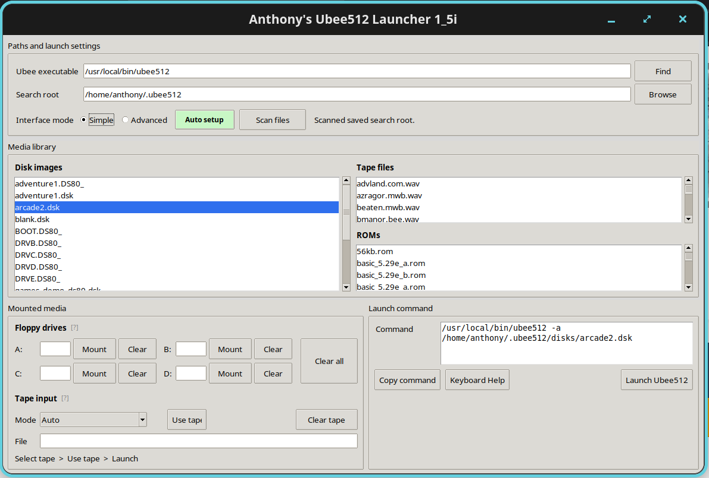

# AI Control Centre

A lightweight Linux control panel for running local AI services without manually managing processes, ports, models and GPU resources.

**Current release: 1.0.8**



AI Control Centre is designed for local AI workstations where several tools may compete for CPU, RAM and GPU resources. It starts the services required for the selected task, checks readiness, monitors the system and keeps machine-specific configuration separate from the application.

## Key features

- **Coding, Chat, Agent and Image** task environments
- recursive local GGUF discovery, including split models
- per-model llama.cpp tuning
- configurable Agent harnesses
- interactive terminal-service support for CLI tools such as Aider
- dependency-aware service startup and shutdown
- readiness checks and service logs
- CPU, RAM, GPU, VRAM and temperature monitoring where supported
- resource-conflict handling for competing workloads
- Prompt Workshop with configurable CPU/GPU Prompt Helper
- user-level Linux installation with desktop launcher

AI Control Centre manages services you have already installed and configured. It does not install llama.cpp, ComfyUI, Docker, AI models or other AI applications for you.

## Requirements

AI Control Centre currently targets desktop Linux.

Required:

- Python 3.11 or newer
- Python virtual-environment support
- Tkinter
- `rsync`
- Bash

Ubuntu, Pop!_OS, Linux Mint and Debian:

```bash
sudo apt update
sudo apt install -y python3-venv python3-tk rsync
```

Fedora:

```bash
sudo dnf install python3 python3-tkinter rsync
```

Arch Linux:

```bash
sudo pacman -S python tk rsync
```

The installer checks prerequisites before modifying an existing installation.

## Install

Clone the repository:

```bash
git clone https://github.com/gbhobbytech/AI-Control-Centre.git
cd AI-Control-Centre
```

Install for the current user:

```bash
chmod +x installer/install.sh installer/uninstall.sh
./installer/install.sh
```

The application is installed under:

```text
~/.local/share/ai-control-centre
```

User configuration and runtime state remain separate:

```text
~/.config/ai-control-centre
~/.local/state/ai-control-centre
```

Existing configuration is preserved when the installer is run again.

## Launch

Open **AI Control Centre** from your Linux application menu or run:

```bash
ai-control-centre gui
```

If `~/.local/bin` is not on your shell `PATH`:

```bash
~/.local/bin/ai-control-centre gui
```

To open the Setup Wizard directly:

```bash
ai-control-centre setup
```

## First run

The Setup Wizard guides you through:

1. hardware and model-location detection
2. local GGUF discovery
3. Coding, Chat and Agent model selection
4. Agent harness selection
5. model tuning
6. Prompt Helper settings
7. review and save

Settings can later be changed from **Preferences > Settings**. Models can be rediscovered with **Preferences > Rescan Models**.

## Model and resource management

Each main llama.cpp model can store its own GPU layers, context length, reply length, K/V cache formats, flash-attention setting and startup timeout.

AI Control Centre also provides **Conservative**, **Balanced** and **Maximum GPU** starting suggestions based on detected hardware and model size. These are starting points rather than guaranteed optimal settings.

The System panel can display CPU, RAM, GPU, VRAM and temperature information where supported. Resource conflicts can be detected before competing launcher-controlled workloads are started.

## Agent harnesses

Agent is configured as **model + harness**.

A harness can combine one or more services with the interface that should open when the environment is ready. This keeps the Agent task independent of any single automation runtime.

Configured services can currently use three service types:

- `process` - background processes and local servers such as llama.cpp and ComfyUI
- `docker` - existing Docker containers such as an isolated Computer environment
- `terminal` - interactive command-line applications that require a real terminal/TTY

Terminal services are useful for interactive local AI tools such as Aider. AI Control Centre launches the tool in the user's configured terminal, tracks the interactive process rather than the terminal launcher, and integrates it with normal dependency startup, service state and Stop All behaviour.

For example:

```toml
[services.aider]
display_name = "Aider"
type = "terminal"
executable = "~/ai/venvs/aider/bin/aider"
cwd = "~/ai/projects/example-project"

args = [
  "--model", "openai/local-model",
  "--openai-api-base", "http://127.0.0.1:8080/v1",
  "--openai-api-key", "local",
  "--no-show-model-warnings",
  "--no-show-release-notes",
  "--no-check-update",
  "--no-browser"
]

terminal_executable = "x-terminal-emulator"
terminal_args = ["-e"]
startup_grace = 0.75
stop_timeout = 10
gpu = false
dependencies = ["llama"]
```

In this arrangement AI Control Centre selects and starts the llama.cpp model, waits for the LLM service to become ready, then launches Aider interactively. The generic `openai/local-model` name keeps the harness independent of the specific GGUF model loaded by the Control Centre.

## Configuration

AI Control Centre uses TOML configuration for:

- application settings
- services
- models
- task profiles
- Agent harnesses

Service definitions remain machine-configurable rather than hard-coded into the application. New process, Docker and interactive terminal services can therefore be added without modifying the main application code.

Machine-specific paths, ports and model choices are kept outside the main program logic.

Reference configuration for the original development workstation is available under:

```text
examples/reference/
```

It is an example, not a required directory layout.

## Command line

The GUI is the normal interface, but service-management commands are also available:

```bash
ai-control-centre status
ai-control-centre models list
ai-control-centre gpu
ai-control-centre stop-all
```

Run:

```bash
ai-control-centre --help
```

for the complete command list.

## Update

Stop launcher-owned services:

```bash
ai-control-centre stop-all
```

Then run the installer from the newer source tree:

```bash
./installer/install.sh
```

Application files are replaced while user configuration and runtime state are preserved.

## Uninstall

Run:

```bash
./installer/uninstall.sh
```

The uninstaller removes AI Control Centre itself. It leaves your configuration, models, llama.cpp, ComfyUI, Docker data and other AI tools untouched.

## Development

Create an editable environment:

```bash
python3 -m venv .venv
source .venv/bin/activate
python -m pip install -e .
```

Run the automated tests:

```bash
PYTHONPATH=src python -m pytest -q
```

## Project scope

AI Control Centre is intentionally a small, task-oriented control layer rather than a general AI application catalogue, model marketplace or infrastructure dashboard.

Its focus is user-configured local AI services on Linux, particularly systems where GPU memory and other resources need to be managed carefully.

## Licence

AI Control Centre is released under the MIT License. See [LICENSE](LICENSE).
